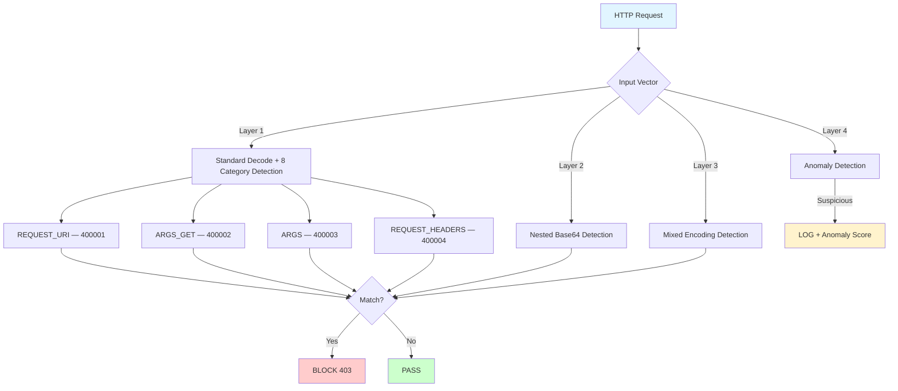

# So Sánh Chi Tiết: Enumeration vs. Generalized trong Phát Hiện NoSQL Injection

## Tóm Tắt

| Tiêu chí | Enumeration (100130-100146) | Generalized (400000-400014) |
|----------|---------------------------|----------------------------|
| **Rules** | 17 | 15 (ít hơn!) |
| **Lines** | 114 | 464 |
| **Patterns** | 9 (vague, false positive cao) | 8 categories (structure-based) |
| **MongoDB operators** | 2 (`$where`, `$or`) | **16+** operators |
| **Database coverage** | MongoDB only | MongoDB + Redis + CouchDB |
| **Log messages** | ❌ Sai ("XSS") | ✅ Đúng ("NoSQLi") |
| **Score variable** | ❌ `tx.xss_score` | ✅ `tx.nosql_injection_score` |
| **Manual test** | — | **24/24 blocked** |
| **GoTestWAF TP** | — | **98.95%** (661/668) |

---

## 1. Phân Tích Rules Nhóm Nghiên Cứu

**File:** `REQUEST-941-APPLICATION-CUSTOM-ATTACK-NOSQL-INJECTION.conf` — 114 lines, 17 rules (100130-100146)

### Regex Pattern (dùng chung):

```regex
(?:\bnew\s+Date\b|do\s*{|\bwhile\b|db\.injection\.insert\b|
 true\b|\$where\b|\bvar\s+\w+\s*=\s*[^;]+;|\d+\s*==\s*\d+|;|\$or\b)
```

### Phân Tích Từng Pattern:

| Pattern | Mục đích | Đánh giá |
|---------|----------|----------|
| `new Date` | JS Date injection | ⚠️ FP cao — JS hợp lệ dùng `new Date()` |
| `do {` | JS do-while | ⚠️ FP cao — code JS bình thường |
| `while` | JS while loop | ❌ **FP cực cao** — từ "while" trong văn bản |
| `db.injection.insert` | MongoDB insert | ❌ Quá cụ thể — chỉ 1 collection name `injection` |
| `true` | Boolean | ❌ **FP cực cao** — bất kỳ text nào chứa "true" |
| `$where` | MongoDB operator | ✅ Hợp lệ |
| `var x = ...;` | JS variable | ⚠️ FP — JS code hợp lệ |
| `N == N` | Equality | ⚠️ FP |
| `;` | Statement terminator | ❌ **FP cực cao** — mọi URL có `;` bị block |
| `$or` | MongoDB operator | ✅ Hợp lệ nhưng thiếu nhiều operators |

### Lỗi Nghiêm Trọng:

```
❌ msg: 'Detected XSS in URL path payload'     → Phải là "NoSQL Injection"
❌ setvar: tx.xss_score                         → Phải là tx.nosql_injection_score
❌ 6/9 patterns gây false positive cực cao
❌ 17 rules cho 4 vectors (redundant)
❌ Thiếu: $ne, $gt, $lt, $regex, $exists, $nin, $not, $in + 16 operators khác
❌ 0% Redis coverage
❌ 0% CouchDB coverage
```

---

## 2. Kiến Trúc Rules Mới

**File:** `REQUEST-944-APPLICATION-CUSTOM-ATTACK-NOSQL-GENERALIZED.conf` — 464 lines, 15 rules (400000-400014)



### 8 Pattern Categories:

| # | Category | Patterns | Database |
|---|----------|----------|----------|
| 1 | **MongoDB Query Operators** | `$ne`, `$eq`, `$gt`, `$gte`, `$lt`, `$lte`, `$in`, `$nin`, `$not`, `$exists`, `$regex`, `$type`, `$mod`, `$size`, `$all`, `$elemMatch`, `$where` | MongoDB |
| 2 | **Logical Operators** | `$or`, `$and`, `$nor` with structure `[{` or `:{` | MongoDB |
| 3 | **Update/Aggregation** | `$set`, `$unset`, `$push`, `$pull`, `$addToSet`, `$inc`, `$rename`, `$group`, `$project`, `$lookup`, `$match`, `$sort` | MongoDB |
| 4 | **JavaScript Injection** | `function(`, `this.x =`, `eval(`, `process.exit/env`, `require('child_process'/'fs'/'net')`, `db.collection.find/insert/update/remove/drop/aggregate` | MongoDB |
| 5 | **Auth Bypass** | `{"$ne": null}`, `{"$gt": ""}`, `[$ne]`, `$ne:` patterns | MongoDB |
| 6 | **NoSQL Syntax** | `ObjectId()`, `ISODate()`, `NumberLong()`, `mapReduce()`, `forEach()`, `toArray()` | MongoDB |
| 7 | **Redis Commands** | `EVAL`, `EVALSHA`, `CONFIG`, `FLUSHALL`, `FLUSHDB`, `DEBUG`, `SHUTDOWN`, `SLAVEOF`, `REPLICAOF`, `MODULE`, `SET/GET/DEL/KEYS` | Redis |
| 8 | **CouchDB** | `_all_docs`, `_design/`, `_view/`, `_find`, `_changes`, `emit()`, `startkey/endkey`, `selector: {$gt/$lt}` | CouchDB |

### Transformation Pipeline:

```
t:urlDecodeUni → t:base64Decode → t:htmlEntityDecode → t:compressWhitespace → t:lowercase
```

> Không dùng `t:replaceComments` (NoSQL không dùng `/* */` comments)

---

## 3. So Sánh Coverage Chi Tiết

### MongoDB Operators:

| Operator | Mục đích | Old Rules | New Rules |
|----------|----------|-----------|-----------|
| `$where` | JS query | ✅ | ✅ |
| `$or` | Logical OR | ✅ | ✅ |
| `$ne` | Not equal (auth bypass) | ❌ | ✅ |
| `$gt` / `$gte` | Greater than | ❌ | ✅ |
| `$lt` / `$lte` | Less than | ❌ | ✅ |
| `$in` / `$nin` | In/not in array | ❌ | ✅ |
| `$exists` | Field exists | ❌ | ✅ |
| `$regex` | Regex matching | ❌ | ✅ |
| `$type` | Type checking | ❌ | ✅ |
| `$not` | Logical NOT | ❌ | ✅ |
| `$set` / `$unset` | Update operators | ❌ | ✅ |
| `$push` / `$pull` | Array update | ❌ | ✅ |
| `$group` | Aggregation | ❌ | ✅ |
| `$project` | Projection | ❌ | ✅ |
| `$lookup` | Join | ❌ | ✅ |

### Attack Techniques:

| Technique | Old | New |
|-----------|-----|-----|
| Auth bypass (`{"$ne":null}`) | ❌ | ✅ |
| JS injection (`function(){}`) | ⚠️ Vague | ✅ Structure-based |
| MongoDB commands (`db.users.drop()`) | ❌¹ | ✅ |
| Redis FLUSHALL/CONFIG | ❌ | ✅ |
| CouchDB _all_docs/_find | ❌ | ✅ |
| Nested Base64 encoding | ❌ | ✅ |
| Mixed encoding | ❌ | ✅ |

> ¹ Old rule chỉ match `db.injection.insert` — 1 collection name cụ thể

---

## 4. Kết Quả Test

### Manual Tests: 24/24 Blocked ✓

| Category | Tests | Result |
|----------|-------|--------|
| MongoDB Operators | 7 | 7/7 ✅ |
| Auth Bypass | 2 | 2/2 ✅ |
| JS Injection | 4 | 4/4 ✅ |
| MongoDB Commands | 3 | 3/3 ✅ |
| Update/Aggregation | 3 | 3/3 ✅ |
| Redis | 3 | 3/3 ✅ |
| CouchDB | 2 | 2/2 ✅ |
| Base64 Encoded | 1 | 1/1 ✅ |
| **Total blocks** | **25** | **25/25** |

### GoTestWAF Results (CRS + Custom NoSQLi):

| Category | Baseline CRS | CRS + NoSQLi Rules | Δ |
|----------|-------------|---------------------|---|
| sql-injection | 66.67% | **100%** | +33.33% |
| xss-scripting | 63.23% | 99.10% | +35.87% |
| shell-injection | 75.00% | 100% | +25% |
| rce-urlparam | 100% | 100% | — |
| **Overall TP** | **74.70%** | **98.95%** | **+24.25%** |

### Custom Rule Audit Log:

```
17 × Rule 400003 (ARGS — POST/JSON)
 5 × Rule 400002 (ARGS_GET — URL Params)
 3 × Rule 400001 (REQUEST_URI — URL Path)
─────────────────
25 total custom rule matches
```

---

## 5. So Sánh False Positive

| Input | Old Rules | New Rules |
|-------|-----------|-----------|
| `?query=true` | ❌ BLOCKED (match `true`) | ✅ PASS |
| `?page=1;sort=asc` | ❌ BLOCKED (match `;`) | ✅ PASS |
| `?text=while reading...` | ❌ BLOCKED (match `while`) | ✅ PASS |
| `?date=new Date()` | ❌ BLOCKED (match `new Date`) | ✅ PASS |
| `?status=1==1` | ❌ BLOCKED (match `N==N`) | ✅ PASS |
| `?name=John Smith` | ✅ PASS | ✅ PASS |

> Old rules block 5/6 benign inputs → ~83% false positive rate cho input chứa keywords phổ biến

---

## 6. Kết Luận

| Aspect | Winner | Lý do |
|--------|--------|-------|
| **Coverage** | 🏆 **Generalized** | 8 categories, 3 databases vs 9 vague patterns, 1 DB |
| **False Positive** | 🏆 **Generalized** | Structure-based vs keyword matching (`;`, `true`) |
| **Correctness** | 🏆 **Generalized** | Đúng log msg + score variable |
| **Efficiency** | 🏆 **Generalized** | 15 rules vs 17 rules |
| **Auth Bypass** | 🏆 **Generalized** | `$ne:null`, `$gt:""` detection (mới) |
| **Multi-DB** | 🏆 **Generalized** | MongoDB + Redis + CouchDB vs chỉ MongoDB |
| **Encoding** | 🏆 **Generalized** | 3-layer decoding (mới) |

---

**Document Version:** 1.0  
**Date:** 25/02/2026
